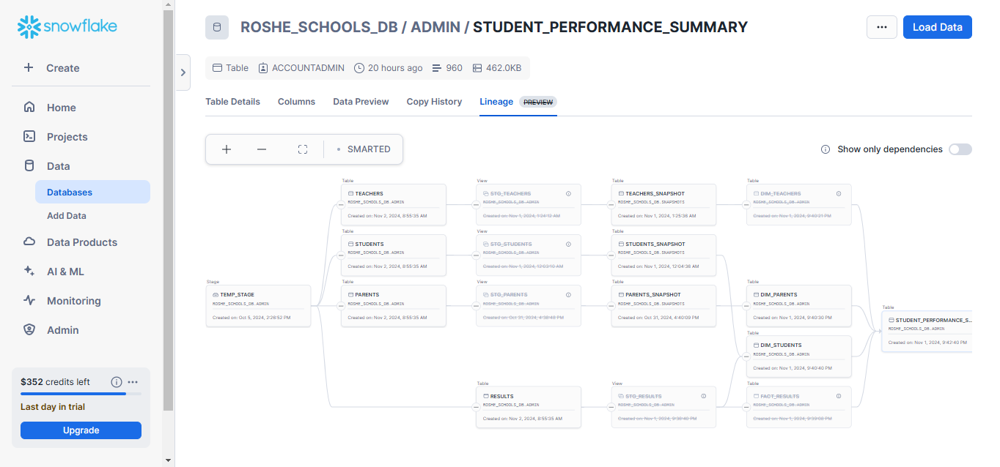

# SmartEd Analytics: Improving Student Performance through Data-Driven Insights
## Introduction
SmartEd Analytics is a proof-of-concept solution developed for [DataFestAfrica Hackathon 2024](https://portfolio.diceytech.co.uk/project-opportunity/1727715039866x124628249482625020) to address the lack of data infrastructure in African secondary schools. This project is centered on Roshe Schools International in Lagos, Nigeria, which currently uses manual methods to record and manage student data. This solution implements a data pipeline and warehousing infrastructure that transforms fragmented records into actionable insights to improve academic performance in key exams like JAMB and WASSCE.

## Data Collection and Generation Methodology
To simulate a real-world data environment, synthetic data was generated based on the structure and organization of an [actual secondary school in Lagos](https://roshallomschools.com/secondary-school/academics/sss-senior-secondary-school/), which groups senior secondary students into four academic streams: Basic Science and Maths, Technical and Agricultural, Commercial, and Liberal Arts and Social Science. Using a [Python script](https://github.com/uche-madu/smarted_analytics/blob/main/generate_data.py), this data is populated into Google Sheets to facilitate streamlined data entry by form teachers and administrators with minimal tech skills. Each term-based record collected covers key metrics:

- **[Academic Results](https://docs.google.com/spreadsheets/d/1FnoP8w1nzwH8z0WwLClakpvu4HK-heagXR5eQ9izdys/edit?gid=1746057588#gid=1746057588)**: Term-specific scores from SS1 to SS3, covering continuous assessments, exams, attendance, and overall averages.
- **[Student Bio Data](https://docs.google.com/spreadsheets/d/1VI3wiL3kecKAgL1Tnv6iWBFGxn6pQDYocQAYGGqG-P0/edit?gid=397552977#gid=397552977)**: Core student demographics, such as age, state of origin, and gender.
- **[Parent Bio Data](https://docs.google.com/spreadsheets/d/10L03aVGbMIyLtVGumX58y1k4PfPe8NwtZH-K6nBXLOU/edit?gid=2000885865#gid=2000885865)**: Parental socio-economic and engagement information, including education level, income bracket, and attendance at school events.
- **[Teacher Bio Data](https://docs.google.com/spreadsheets/d/1P8gBY1106mxmJQZdW-emz1q5v0vkfUrEwlp2xhXbWu8/edit?gid=266312471#gid=266312471)**: Teacher qualifications, years of experience, subject expertise, and remarks for students in each term.

This data collection process was designed to emulate real-world data input, including AppSheet integration (planned for future implementation) to facilitate an intuitive mobile-friendly interface for data entry directly into Google Sheets. This setup mimics how administrators might actually capture and maintain student performance data.

## Solution Overview
The SmartEd Analytics data pipeline is structured with a Medallion Architecture in Snowflake, [orchestrated with Airflow](https://github.com/uche-madu/smarted_analytics/blob/main/dags/google_sheets_to_snowflake_dags.pyy), and [transformed with dbt](https://github.com/uche-madu/smarted_analytics/tree/main/dags/dbt/roshe_schools_analytics). This architecture provides a clear flow from raw data extraction to insightful analysis-ready data.

## Project Structure and Visuals
This section would provide an overview of the project with relevant screenshots and schema visuals for added clarity.

### Snowflake and Airflow Workflow


The Snowflake Data Warehouse provides storage for staging views, fact tables, dimension tables, and marts.


The Airflow DAG automates the data pipeline, handling extraction from Google Sheets, transformation in dbt, and loading into Snowflake.

### Data Warehouse Schema
The project schema can be viewed [here](https://dbdocs.io/dreemer6/SmartEd-Data-Warehouse-Design), providing a detailed view of tables and relationships within the SmartEd Analytics data warehouse.

## Data Pipeline and Medallion Architecture
The data pipeline integrates Google Sheets data with Snowflake, orchestrating extraction, transformation, and loading (ETL) steps with Airflow and dbt:

- **Bronze Layer**: Raw, uncleaned data directly from Google Sheets.
- **Silver Layer**: Cleaned and transformed data organized into Dimension (`students`, `parents`, `teachers`) and Fact (`results`) tables.
- **Gold Layer**: The final curated data layer featuring marts. The current “One Big Table” (OBT) mart, `student_performance_summary`, consolidates detailed performance records, tracking term-based metrics for each student and supporting granular longitudinal analysis.

The pipeline is designed for easy extension and can incorporate additional marts as needed to address specific analytical use cases.

## Gold Layer: One Big Table Mart - `student_performance_summary`
The `student_performance_summary` mart is structured as an OBT to consolidate term-specific student data with teacher and parental contextual data, enabling comprehensive analysis. Each record in this table contains:

- **Academic Metrics**: Subject-wise CA1, CA2, and exam scores, attendance, and final grades.
- **Teacher Data**: Teacher qualifications, experience, and remarks associated with each subject per term.
- **Parental Engagement**: Information on family socio-economic status, language, and parental engagement with the school.

### WASSCE Readiness Indicator (`wassce_pass`)
A key feature of this mart is the `wassce_pass` indicator, which flags students likely to pass the WASSCE based on performance criteria. Derived to assess exam readiness, this indicator requires a **minimum passing grade of C6 (50%)** in **English Language**, **Mathematics**, and **three additional subjects**. This metric supports term-over-term tracking of student readiness and offers early insight into WASSCE preparedness, allowing the school to focus on at-risk students.

## Workflow Automation with Airflow
Airflow automates the entire ETL process, streamlining data extraction from Google Sheets, staging in Snowflake, and performing dbt transformations to populate the Silver and Gold layers:

- **Extraction Tasks**: Data is extracted, validated, and saved in staging tables within Snowflake.
- **dbt Transformation**: dbt models transform and test data, ensuring high data quality in each warehouse layer.
- **Airflow DAG**: The structured Airflow DAG manages task dependencies and efficiently scales the ETL process, running tasks in parallel where feasible and supporting robust data lineage.

## Data Quality and Model Optimization with dbt
Data quality is ensured with dbt’s built-in and custom tests, covering uniqueness, null constraints, and relationships within the dimension and fact tables. Snapshots of dimensions are taken to support Slowly Changing Dimensions (SCD Type 2), enabling tracking of historical changes in student, teacher, and parent information.

Additionally, dbt macros were utilized to reduce code duplication, improving the maintainability of SQL code across models and transformations.

## Key Insights and Analytical Applications
With the current data structure, the school can leverage insights to answer essential questions such as:

- How consistent is a student’s academic performance across terms?
- What impact does teacher qualification and experience have on student performance?
- How do socio-economic factors, such as parental education and income, influence student success?
- What is the likelihood of each student passing the WASSCE?

These insights provide a strong foundation for future predictive modeling, supporting data-driven decision-making and targeted student interventions.

## Planned Enhancements and Future Directions
This project is designed with flexibility to incorporate additional features and tools to enhance its functionality. Planned improvements include:

- **AppSheet Integration**: To facilitate intuitive data entry, a mobile-friendly AppSheet app will be connected to the Google Sheets for easier, on-the-go input by teachers and administrators.
- **Visualization and Dashboarding**: Building dashboards using Looker or Tableau to present real-time metrics and trends for student performance and parental engagement.
- **Machine Learning Models**: Future models could predict WASSCE performance and highlight students at risk based on trends in the mart’s data.
- **Additional Marts**: Adding specialized marts in the Gold layer to support various analyses, such as attendance patterns, health data impact, and term-over-term score growth.

## How to Run the Project
### Prerequisites
- **Python 3.10** with a virtual environment.
- **Astro CLI** installed ([Installation Guide](https://www.astronomer.io/docs/astro/cli/install-cli)).
- **Google Sheets API Credentials**.

### Step 1: Clone the Repository and Navigate to Project Directory
```bash
git clone https://github.com/uche-madu/smarted_analytics.git
cd smarted_analytics
```

### Step 2: Set Up a Virtual Environment and Install Requirements
```bash
python -m venv venv
source venv/bin/activate  # On Windows: venv\Scripts\activate
pip install -r requirements.txt
```
### Step 3: Configure Google Sheets API
1. Create API credentials in Google Cloud Console and download the service account key to the root folder as `.credentials.json`.
2. Set up a `.googlesheets.env` file in the root folder with the following variables:

    ```env
    GOOGLE_SHEET_URL_RESULTS=https://_your_sheet_url
    GOOGLE_SHEET_URL_STUDENTS=https://_your_sheet_url
    GOOGLE_SHEET_URL_PARENTS=https://_your_sheet_url
    GOOGLE_SHEET_URL_TEACHERS=https://_your_sheet_url
    SERVICE_ACCOUNT_FILE=.credentials.json
    ```
3. Update your Google Sheets permissions by allowing the *service account email* to **edit** each sheet or set the permissions to *"Anyone with the link"* can edit.

### Step 4: Create a Snowflake Warehouse and Configure Airflow Connection
1. Set up a Snowflake warehouse and database in your [Snowflake account](https://signup.snowflake.com/).
2. Configure the "**snowflake_default**" connection in Airflow to point to your Snowflake database.

### Step 5: Edit the Dockerfile (if using Astro CLI)
If using **Astro CLI**, update the `ENV PYTHONPATH` in the Dockerfile to your project directory.

### Step 6: Generate Data and Load into Sheets
```bash
python generate_data.py
```
This script will automatically populate the Google Sheets with sample data.

### Step 7: Start Airflow and Trigger the DAG
1. Run the following command to start Airflow locally using Astro CLI:
    ```bash
    astro dev start
    ```
2. Log into the **Airflow UI** at `http://localhost:8080` and trigger the DAG run.

### Step 8: View Data in Snowflake
Once the DAG is complete, your Snowflake warehouse database will be populated with **staging views**, **fact table**, **dimension tables** and **marts**.

### Bonus: Generate ERD
From the dbt project root, run the following commands:
```bash
dbt docs generate
dbterd run -ad target/
```
Copy the content of target/output.dbml and paste it into [dbdiagram.io](https://dbdiagram.io) to create an ERD.
